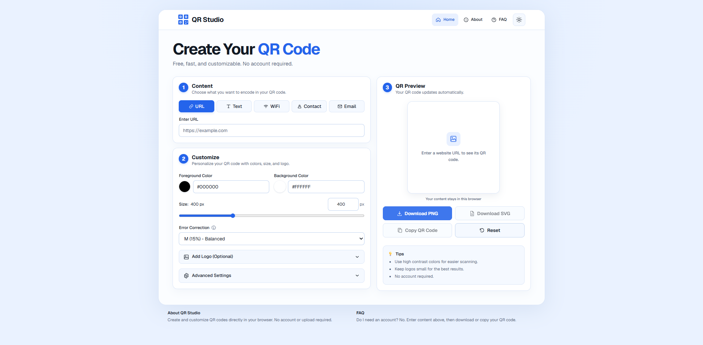

# QR Studio

A fast, privacy-friendly QR code generator built with Next.js and TypeScript.

Create customizable QR codes for URLs, text, WiFi networks, contacts, and email directly in your browser. No account required.

### 🌐 Live Demo

**[qriyo.vercel.app](https://qriyo.vercel.app)**

## Preview



## Features

- Generate QR codes for URLs, text, WiFi, contacts, and email
- Customize foreground and background colors
- Adjust QR code size and error correction level
- Add a custom logo
- Download QR codes as PNG or SVG
- Copy QR codes directly to the clipboard
- Light and dark themes
- Responsive design for desktop, tablet, and mobile
- No account required
- Client-side processing for privacy

## Tech Stack

- Next.js
- TypeScript
- Tailwind CSS
- node-qrcode

## Privacy

QR Studio processes QR content and uploaded logos directly in your browser.

No accounts, analytics, database, or external QR API are required. QR content and uploaded images are not sent to a server for QR generation.

## Run Locally

Clone the repository and install the dependencies:

```bash
npm install
npm run dev
```

Then open:

```text
http://localhost:3000
```

## Testing

The project includes automated tests and has been tested across multiple screen sizes and browsers.

```bash
npm test
npm run lint
npx tsc --noEmit
npm run build
```

## Project Structure

```text
src/app/                    Application pages, metadata, and styles
src/components/qr-studio/   QR Studio interface and components
src/lib/qr-studio/          QR generation and payload logic
tests/                      Unit tests
public/screenshots/         Project screenshots
```

## Author

Built by **Joshua Ansiboy**.
